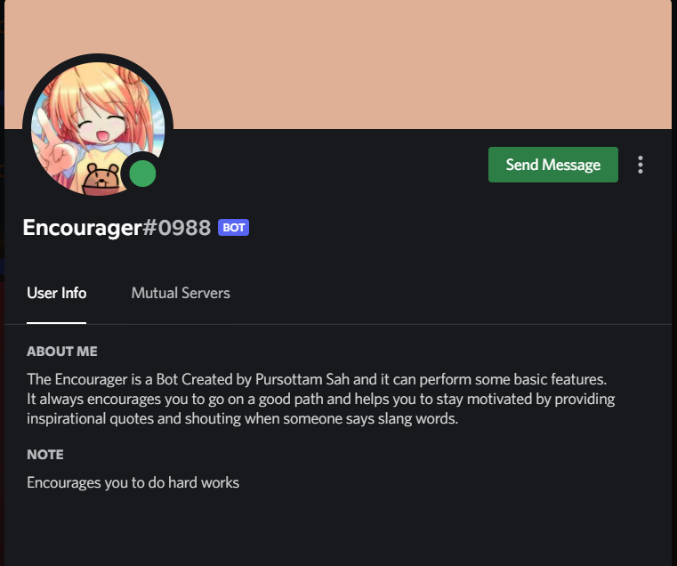
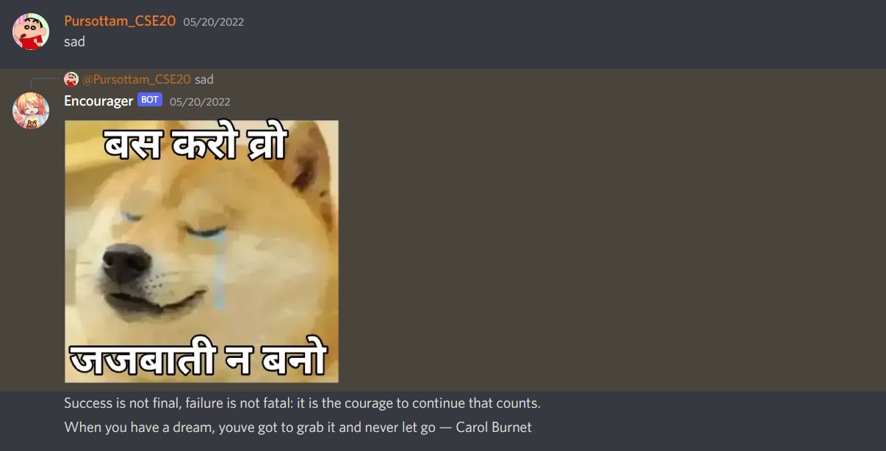
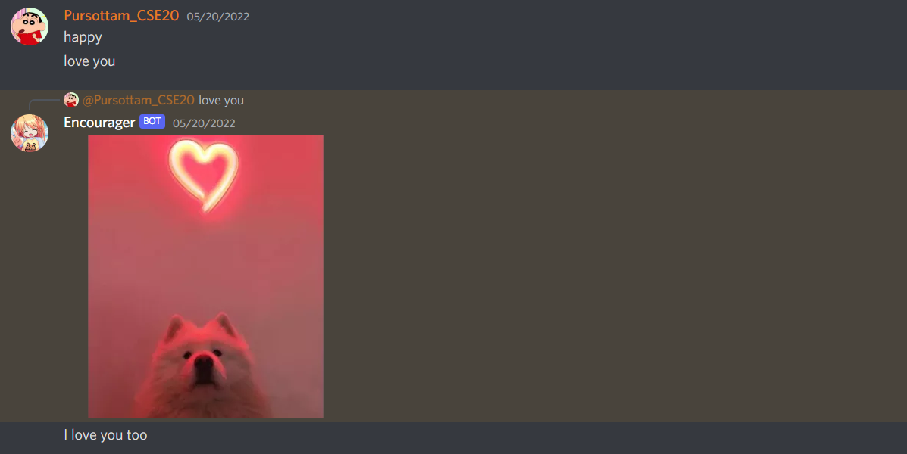
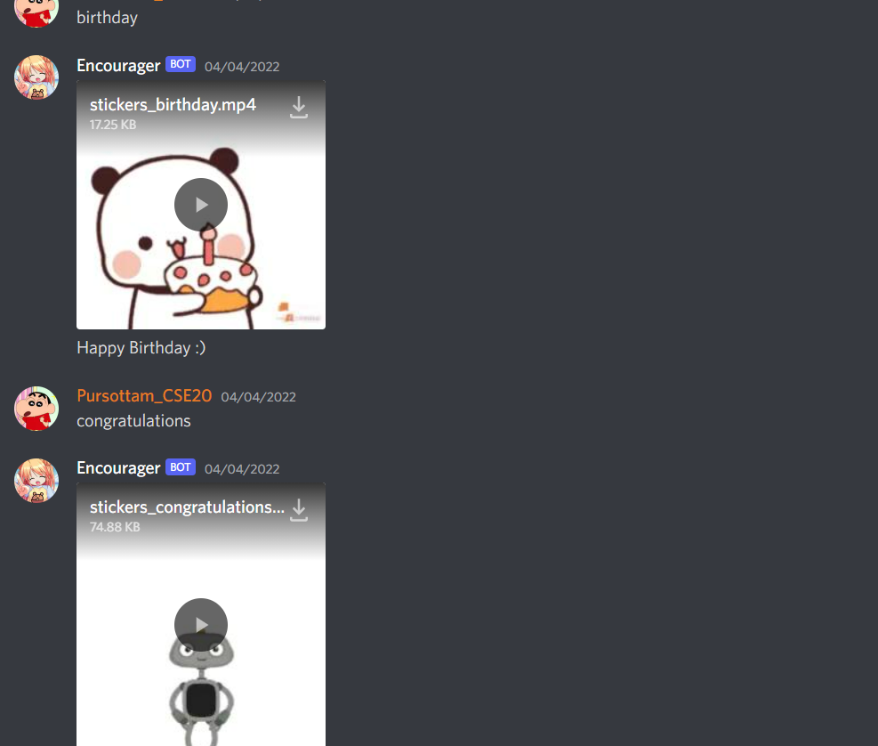
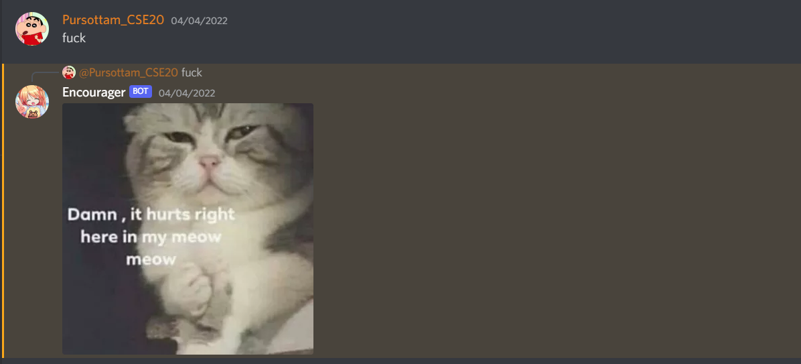
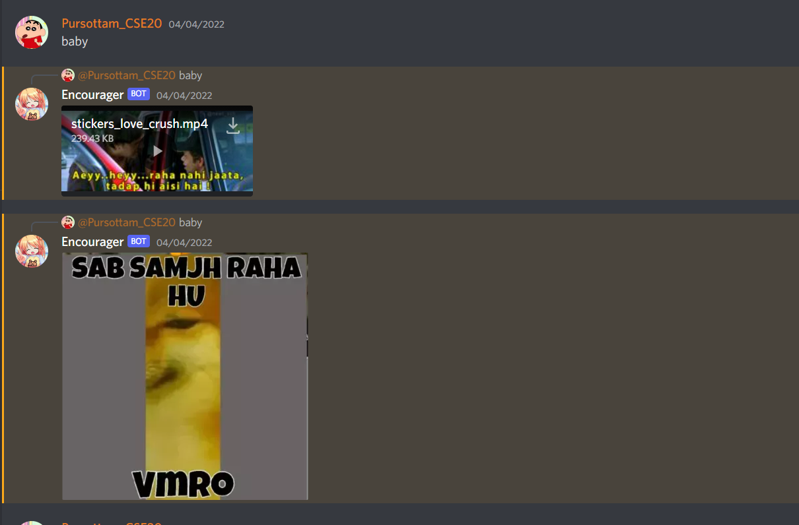

# Encourager
## Hello Everyone

#### I am glad to introduce that i have developed my first Discord Bot using Python and [Developers Discord]('https://discord.com/developers/docs/intro') and the application is hosted on [Heroku Platform](https://dashboard.heroku.com/login) 

### Greetings is done based on the current time and date of a particular day 

## Features and Characteristics
* Basically it is a meme bot designed for the School and College Students for having a fun and healthy communication

* It Encourages users and on the basis of their chat keywords replies to them within the server 

* It also sends random motivational and inspirational quotes  from  [Quoteble api](https://github.com/lukePeavey/quotable) if someone is Sad and encourages the students

* Moreover it is user friendly it sends memes on the basis of chat messages 

* Helps and greet new students who joined the groups 

### Demo 

1. When someone is Sad 

2. When you send someone romantic messages 

3. When you share enjoyful and joyful messages

4. When you send bad words it sends voilent and arrogent messages

5. When students send messages to thier crush :) it sends romantic memes

## Thanks for  Watching 
